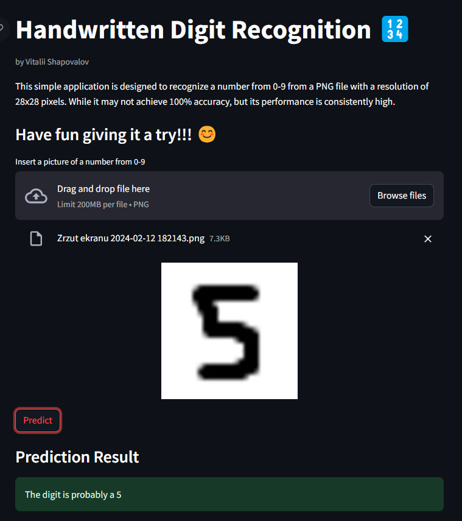

# Handwritten Digit Recognition

This repository contains a small project for recognizing handwritten digits using TensorFlow and Streamlit.

## Overview

This project consists of two main parts:
1. Training a neural network model to recognize handwritten digits using the MNIST dataset.
2. Creating a simple web application using Streamlit for users to upload images of handwritten digits and get predictions.

## Model Training

The model is trained using TensorFlow with the MNIST dataset, which consists of 28x28 pixel images of handwritten digits from 0 to 9. The architecture of the neural network includes:
- Input layer: Flattened 28x28 pixel image.
- Two hidden layers with 128 neurons each and ReLU activation function.
- Output layer with 10 neurons (one for each digit) and softmax activation function.
- Adam optimizer and sparse categorical crossentropy loss function.

After training for 3 epochs, the model achieves a certain level of accuracy.

## Web Application

The web application is built using Streamlit, a Python library for building interactive web applications. Users can upload PNG images containing handwritten digits, and the application will display the uploaded image and predict the digit using the trained model.

## EXAMPLE

